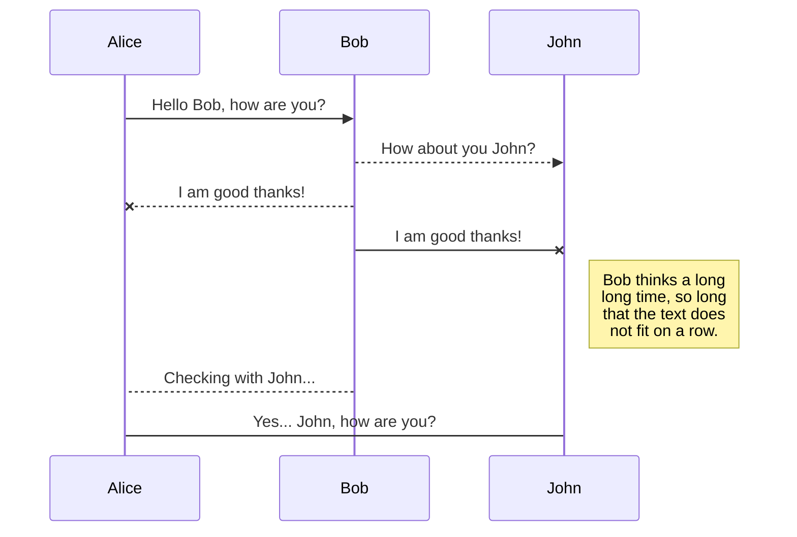
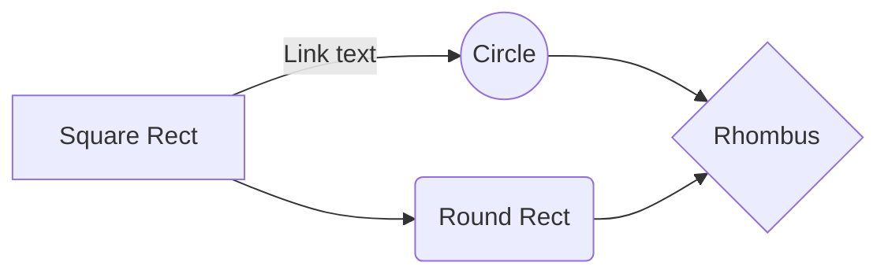

# **Roomie, Web Engineering Project Spring Semester 2018**  
  
- [Introduction](#introduction)  
  - [Overview](#overview)  
  - [Contributors](#contributors)  
  - [Requirements](#the-following-requirements-were-defined)  
  - [Optional Requirements](#optional-requirements)  
- [Pre-Implementation](#pre-implementation)  
  - [Wireframes](#wireframes)  
  - [Database Model](#database-model)  
  - [Use Case Diagram](#use-case-diagram)  
- [Implementation](#implementation)  
    
  
  
  
 - [Domain Model](#domain-model)  
 - [Data Access Model](#data-access-model)  
- [Implementation](#implementation)  
  - [Stage 1: Structure](#stage-1-structure)  
  - [Stage 2: Autoloader and Routing](#stage-2-autoloader-and-routing)  
  - [Stage 3: Database](#stage-3-database)  
  - [Stage 4: Database Access and Domain Objects](#stage-4-database-access-and-domain-objects)  
  - [Stage 5: Business Service](#stage-5-business-services)  
  - [Stage 6: Register/Login](#stage-6-registerlogin)  
  - [Stage 7: Course offerings view frontend](#stage-7-course-offerings-view-frontend)  
  - [Stage 8: PDF creation](#stage-8-pdf-creation)  
  - [Stage 9: Email Service](#stage-9-email-service)  
- [Deployment](#deployment)  
  
  
### Introduction  
###### Overview  
The goal of this project was it, to create a website that connects people that are looking for a room in a shared apartment to people, that are offering a room in a shared apartment in a very pragmatic and simple way.  
  
###### Contributors:  
* Loris Grether (database, front-end)  
* Hermann Grieder (server-side, front-end, GUI)  
* Tobias Gerhard (GUI, Documentation, front-end)  
  
###### The following requirements were defined:  
1. Authentication  
   * If the password is forgotten, it should be possible to get a new one using email  
   * The password is securely stored  
2. Content management by users  
   * Room offerers upload the ads for their room by themselves, using the provided online form  
3. Administration  
   * Deleting/updating user data  
   * Change/delete ads  
   * Ads will be deleted automatically after a certain time period  
4. Room listing  
   * The website provides a list with all the currently available rooms  
5. User registration  
   * User can create an account using email  
   * User can login  
   * User can logout  
   * Remember me function  
6. Search function  
   * The website provides a search function so that user can search for ads with specific criteria  
7. Export function
   * Ads can be exported as PDF  
8. GUI  
   * The GUI is enhanced with CSS and JavaScript to improve usability and make the appearance more appealing  
   * The GUI is responsive, meaning it adapts to the screen size  
9. Minimized error rate  
   * The website should be as error-prone as it is possible within the suggested time exposure  
###### Optional requirements:  
1. Messaging function  
   * Users can get in touch with an advertiser using an integrated message function  
2. Gallery  
   * Users can upload pictures with their ads  
3. Google Maps integration  
   * Google Maps API is used in order to display the place of the room  
4. Autocomplete for addresses  
   * Using the Google places API, users should get place suggestions when filling out the search form  
  
### Pre-Implementation  
###### Wireframes  
In order to have a general idea of the GUI and a better understanding for what we are going to develop, 4 simple mock-ups were created. These wireframes can be found hereafter. However, during implementation we adjusted to our needs.  

  
  
  
  
###### Database Model  
To store the data, a PostgreSQL database was created. The database contains 3 tables; authtoken, apartment, user.  
* **authtoken**: used for the remember-me and password-reset functionality.  
* **apartment**: this table stores data about the apartments that are visible as ads.  
* **user**: the user table stores the data about the users; id, username, mail, as well as the encrypted password.  
  
  
  
The database is designed in a way that one user can have several apartments. However, one apartment corresponds to one user, and only one user.  Additionally it is worth mentioning that the database does not store images as images in the apartment table, it stores links to images, which are stored on an Amazon server (AWS S3).  Hereafter is an image, visualizing this in line 4:


  
###### Use Case Diagram  
Based on the defined requirements, a use case diagram was created. The following diagram illustrates the use cases.   
  
  
  
Most use cases have already been shortly explained in the requirements section. However, hereafter, each of the use cases is explained more in detail.  
* **Register**: unregistered users can create an account which allows them to create ads for a room that they like to offer.  
* **User Login**: registered user that are currently logged out can log in using their credentials (email and password). After that, they have access to edit their profile, their ads, or to create new ads.  
* **Logout**: logged-in users can logout, what terminates the current session.  
* **Search ad**: users can search for rooms with specific requirements (room size, price, etc.).  
* **Contact advertiser**: users can contact an advertiser using a contact form.  
* **Delete account**: users can delete their own account as soon as they are logged in.  
* **Change profile**: users can change their profile data with regards to email and username.  
* **Create ad**: logged-in users can create ads. These ads appear on the website, which displays all the available rooms.  
* **Edit ad**: entries (ads) can be edited with respect to description text, address etc.  
* **Delete ad**: entries (ads) can be fully deleted, so that they do not appear in the database anymore.  
* **Password reset**: if forgotten, users have the possibility to reset their password. 

###### Deployment Diagram
The deployment is pretty straightforward. The code to be executed is stored on a Heroku Webserver. This extends to the database, too. It was initially planned that the images are stored in the PostgreSQL database, which is located on the Heroku Webserver as well. However, during implementation we hit on problems concerning whis matter what finally led to the decision, to adjust the deployment in such a way, that the PostgreSQL database only stores links to images, which are stored on a Amazon AWS S3 server. Subsequently you find the final deployment diagram. 
  
### Implementation  
###### Important Classes
During the implementation phase, the previous plans were implemented. As foundation of the implemented code acts the framework that was developed during classes or pre-developed by the lecturer respectively. It has been adjusted and extended to our needs. Subsequently, important classes are described.  
* **Router**: The router routes the requests to the correct resource/destination.  
* **View**: The view folder contains all the HTML pages that are necessary for the website, including headers and the footer as well as CSS files.  
* **Controller**: The controller folder contains the controller files in order to manipulate the view, or the model respectively.  
* **ListingDAO and UserDAO**: The corresponding class handles the database requests and manipulates the data stored in the respective table.  
* **Listing**: Holds the data for an apartment.  
* **User**: Holds the data for the user. 
* **AWSUploadService**: Responsible for the communication between the Heroku Webserver and the Amazon Server, on which the Images are stored. It uploads the images to the Amazon Server and returns the link of the picture.
###### Database
The database was set up as a PostgreSQL on a Heroku Webserver as defined under the section [Database Model](#database-model), using the following code:
```SQL  
CREATE TABLE apartment  
(  
  id INTEGER DEFAULT nextval('apartment_id_seq'::regclass) PRIMARY KEY NOT NULL,  title VARCHAR(255) NOT NULL,  
  street VARCHAR(255) NOT NULL,  
  zip INTEGER NOT NULL,  numberofrooms VARCHAR(255) NOT NULL,  
  price INTEGER NOT NULL,  squaremeters INTEGER NOT NULL,  publisheddate DATE NOT NULL,  description VARCHAR(1000) NOT NULL,  
  moveindate DATE NOT NULL,  image1 VARCHAR(255),  
  image2 VARCHAR(255),  
  image3 VARCHAR(255),  
  userid INTEGER NOT NULL,  city VARCHAR(255),  
  canton VARCHAR(255),  
  streetnumber INTEGER,  
 CONSTRAINT fkapartment122597 FOREIGN KEY (userid) REFERENCES "user" (id)  
);  
CREATE TABLE authtoken  
(  
  id INTEGER DEFAULT nextval('authtoken_id_seq'::regclass) PRIMARY KEY NOT NULL,  selector VARCHAR(255) NOT NULL,  
  validator VARCHAR(255) NOT NULL,  
  expiration TIMESTAMP NOT NULL,  type INTEGER NOT NULL,  userid INTEGER,  
 CONSTRAINT authtoken_user_id_fk FOREIGN KEY (userid) REFERENCES "user" (id)  
);  
CREATE TABLE user  
(  
  id INTEGER DEFAULT nextval('user_id_seq'::regclass) PRIMARY KEY NOT NULL,  username VARCHAR(255),  
  password VARCHAR(255) NOT NULL,  
  email VARCHAR(255) NOT NULL  
);  
```
  
  
  
  
  
###### Applied techniques, APIs and 3rd party code  
* **[Google Maps API](https://www.google.com "Google's Homepage")**: the Google Maps API is used in order to display the room's location on the map. 
 
* **[Google Places API](https://developers.google.com/maps/documentation/javascript/places-autocomplete?hl=de)**: in addition to the Google Maps API, the Google places API was implemented. Especially the functionality "autocomplete" was implemented. It is restricted to regions in Switzerland.

* **[Amazon AWS S3](https://aws.amazon.com/s3/?nc1=f_ls"Amazon AWS S3")**: Amazon S3 is object storage built to store and retrieve any amount of data from anywhere. In our case, we use it to store images and retrieve them in order to display them on our website.
* **[SendGrid](https://sendgrid.com/"SendGrid")**: SendGrid API is used for any kind of E-Mail communication. For the contact form as well as the reset password functionality.
* **[HyPDF](https://hypdf.com/info/index"HyPDF")**: our website uses the HyPDF API to create PDF.
* AJAX (Sign-up-Form, AJAX wird angewendet, um die Emailadresse zu checken (ob sie bereits besteht) und das Passwort auf seine Gültigkeit zu überprüfen (Klasse View/Modale.php, view/dist/js/validator.js, router.php Zeile 127 (signupValidator)))  
* 404 Page
  
  
### Usage  
Beschreiben, welche buttons welche Aktionen hervorrufen, Suche: AND, nicht OR  
  
  
###### Additionally implemented features to be mentioned:  
*  **Search Functionality:** The website offers search functionalities to serach the available rooms. Additionally it is worth mentioning, that the values "Min Rooms" and "Max Rooms" can't be confused, since in the backend the software maps the values accordingly anyway. This is also true for the values "Min Rent" and "Max Rent".
  
  
  
  
**::::::::::::::::::::::::::::::::::::::::::::::::::::::::::::::::::::::::::::::::::::::::::::::::::::::::::::::::::::::::::::::::::::::::::::::::::::**  
**::::::::::::::::::::::::::::::::::::::::::::::::::::::::::::::::::::::::::::::::::::::::::::::::::::::::::::::::::::::::::::::::::::::::::::::::::::**
**::::::::::::::::::::::::::::::::::::::::::::::::::::::::::::::::::::::::::::::::::::::::::::::::::::::::::::::::::::::::::::::::::::::::::::::::::::**
**::::::::::::::::::::::::::::::::::::::::::::::::::::::::::::::::::::::::::::::::::::::::::::::::::::::::::::::::::::::::::::::::::::::::::::::::::::**


### Conclusion  
To be mentioned:  
- The welcome page displays the newest 3 entries  
- Bilder von Responsiveness hochladen
- All requirements implemented

## UML diagrams

You can render UML diagrams using [Mermaid](https://mermaidjs.github.io/). For example, this will produce a sequence diagram:



And this will produce a flow chart:

